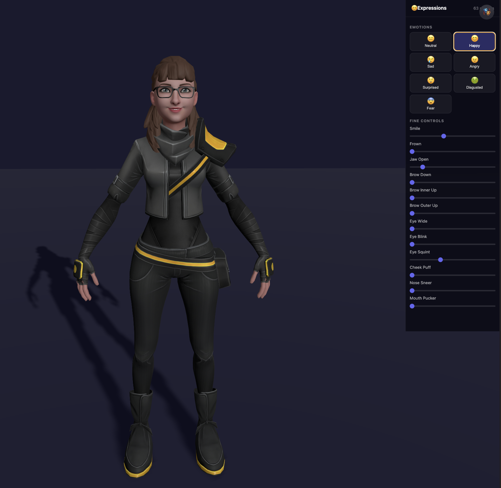

# 3D Avatar - Facial Expression Viewer

Interactive 3D avatar viewer built with Three.js and Vite. Uses a ReadyPlayerMe avatar with ARKit blend shapes to control facial expressions in real time.



## Features

- 7 emotion presets (Neutral, Happy, Sad, Angry, Surprised, Disgusted, Fear)
- 12 fine-control sliders for individual morph targets (Smile, Frown, Jaw, Brows, Eye Blink, Cheek Puff, and more)
- 63 ARKit morph targets driven via Three.js `morphTargetInfluences`
- Collapsible glassmorphism side panel
- OrbitControls with damping for smooth camera interaction
- Vite dev server with hot reload

## Tech Stack

| Tool | Version |
|---|---|
| [Three.js](https://threejs.org/) | 0.184 |
| [Vite](https://vitejs.dev/) | 8 |
| GLTFLoader | bundled with Three.js |
| OrbitControls | bundled with Three.js |

## Getting Started

```bash
npm install
npm run dev
```

Open [http://localhost:5173](http://localhost:5173) in your browser.

```bash
npm run build    # production build
npm run preview  # preview the build
```

## Project Structure

```
my_3d_avatar/
├── public/
│   └── assets/          # GLB model parts (ReadyPlayerMe avatar)
│       ├── SK_Face_Bare.glb
│       ├── SK_Body_Bare.glb
│       ├── SK_Torso_Bare.glb
│       ├── SK_Legs_Bare.glb
│       ├── SK_Feet_Bare.glb
│       └── SK_Glasses.glb
├── src/
│   ├── main.js          # scene, lighting, camera, model loader
│   ├── morphs.js        # emotion presets and morph target utilities
│   └── ui.js            # controls panel, emotion buttons, sliders
├── index.html
└── package.json
```

## How Facial Expressions Work

The face mesh (`Wolf3D_Head`, `Wolf3D_Teeth`) has 63 ARKit blend shapes. Each one deforms part of the geometry, e.g. `mouthSmileLeft` pulls the left corner of the mouth up.

Emotion presets in `src/morphs.js` set multiple targets at once:

```js
happy: {
  mouthSmileLeft: 0.9, mouthSmileRight: 0.9,
  cheekSquintLeft: 0.5, cheekSquintRight: 0.5,
  eyeSquintLeft: 0.35,  eyeSquintRight: 0.35,
}
```

The sliders in `src/ui.js` let you tweak individual targets on top of any preset. Symmetric pairs (Left/Right) share a single slider.

## Avatar Model

Created with ReadyPlayerMe (discontinued Jan 2026, acquired by Netflix), exported as separate GLB parts for modular loading.
